# Pronóstico de Ventas con Series Temporales

**Autor:** Juan Mosquera (A00418986)
**Curso:** Aprendizaje Automático - III Parcial Práctico

## 1. Introducción y Contexto

Una compañía de comestibles enfrenta el desafío de pronosticar con precisión las ventas mensuales de dos productos estrella en su portafolio. Estos productos son críticos para el negocio debido a su alta rotación y margen de contribución, por lo que pronósticos precisos son esenciales para optimizar la planificación de inventario, producción y recursos financieros.

### 1.1 Objetivo

Desarrollar pronósticos robustos para enero 2025 de ambos productos, cuantificando la incertidumbre mediante intervalos de confianza del 95%, y proporcionar recomendaciones operativas basadas en los patrones identificados en las series temporales.

### 1.2 Datos

El análisis se basa en **127 observaciones mensuales** (junio 2014 - diciembre 2024) de ventas históricas:

- **Producto 1:** Tendencia decreciente sostenida (R²=0.76), promedio 344 unidades, CV=29%
- **Producto 2:** Crecimiento con saturación (R²=0.71), promedio 581 unidades, CV=29%
- Ambos productos presentan estacionalidad anual y no contienen valores nulos

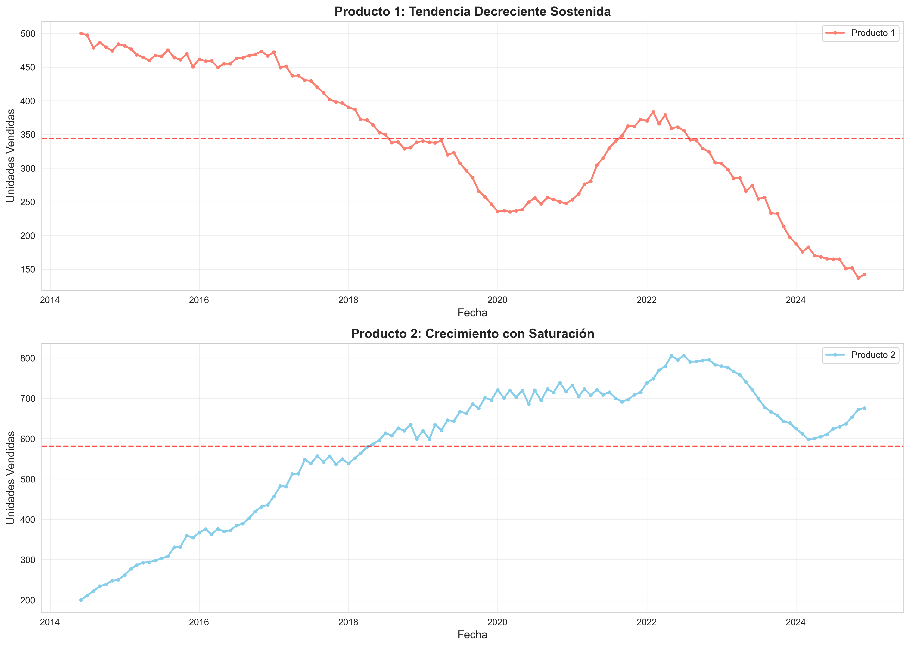
*Figura 1. Series temporales completas mostrando patrones divergentes*

---

## 2. Metodología

### 2.1 Análisis Exploratorio

Se realizó descomposición aditiva (tendencia + estacionalidad + residual) y análisis de estacionariedad mediante pruebas ADF y KPSS. Ambas series resultaron no estacionarias, requiriendo diferenciación de orden 1 para modelado ARIMA.

#### Descomposición de Series

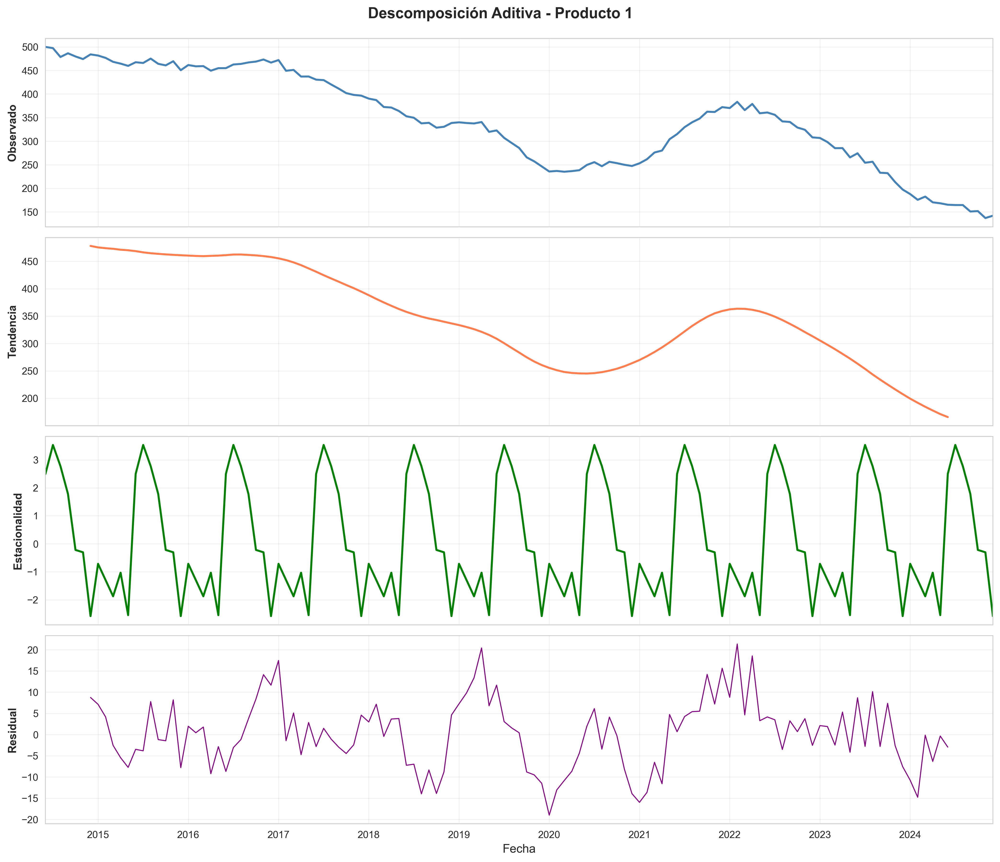
*Figura 2a. Descomposición de la serie temporal - Producto 1*

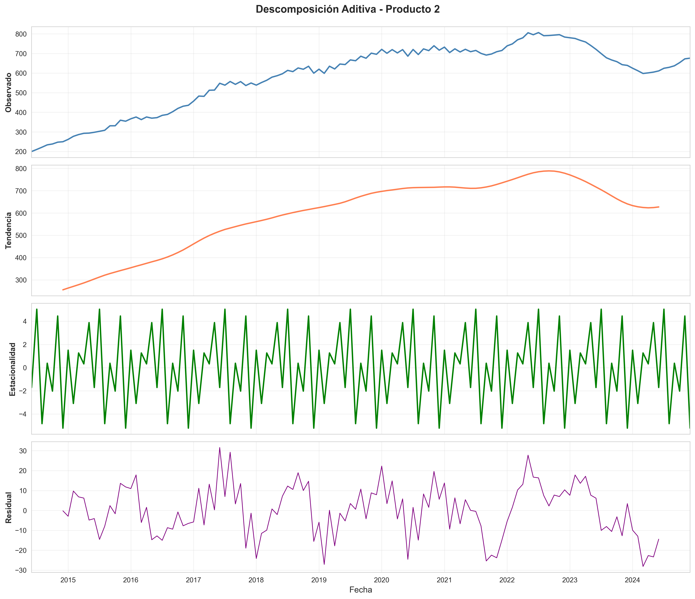
*Figura 2b. Descomposición de la serie temporal - Producto 2*

#### Análisis ACF/PACF

El análisis ACF/PACF de las series diferenciadas sugirió componentes autorregresivos (AR) y de media móvil (MA) significativos.

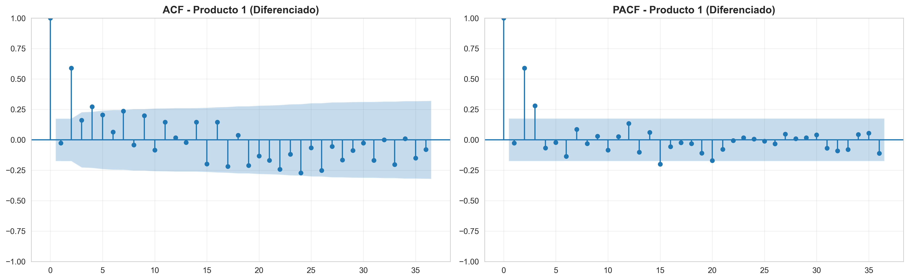
*Figura 3a. Funciones de autocorrelación - Producto 1*

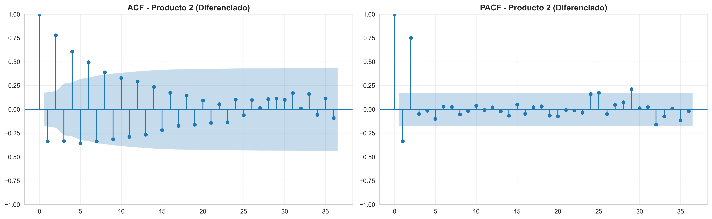
*Figura 3b. Funciones de autocorrelación - Producto 2*

### 2.2 Protocolo de Validación Recursiva

Se implementó validación recursiva que simula la operación real del negocio:

1. **División 85/15:** 107 meses entrenamiento (jun 2014 - abr 2023), 20 meses prueba (may 2023 - dic 2024)
2. **Proceso iterativo:** Para cada período de prueba: entrenar modelo → predecir siguiente mes → incorporar valor real → re-entrenar
3. **Evaluación robusta:** Generar 20 pronósticos independientes (vs. 1 pronóstico en validación estática)

Este protocolo aprovecha progresivamente toda la información disponible y evalúa el desempeño del modelo en múltiples horizontes temporales.

### 2.3 Modelos Evaluados

Se compararon 8 modelos por producto:

| Categoría | Modelos |
|-----------|---------|
| **Baselines** | Media móvil (k=3, 5, 7) |
| **Suavizamiento exponencial** | SES, Holt (tendencia), Holt-Winters (tendencia+estacionalidad) |
| **ARIMA** | Órdenes (1,1,1), (2,1,2), (1,1,2) seleccionados por análisis ACF/PACF |
| **Optimización automática** | ETS Optuna (optimización bayesiana, 100 trials) |

---

## 3. Resultados y Comparación de Modelos

### 3.1 Producto 1: Tendencia Decreciente

El Producto 1 presenta un declive sostenido de **-2.38 unidades/mes**.

| Modelo | RMSE | MAE | MAPE (%) |
|--------|:----:|:---:|:--------:|
| **ARIMA(2,1,2) ✓** | **7.84** | **6.13** | **3.22** |
| Holt | 9.06 | 7.30 | 3.74 |
| ARIMA(1,1,2) | 9.31 | 8.05 | 4.33 |
| ETS Optuna | 9.57 | 7.81 | 4.00 |

*Tabla 1. Comparación de modelos para Producto 1*

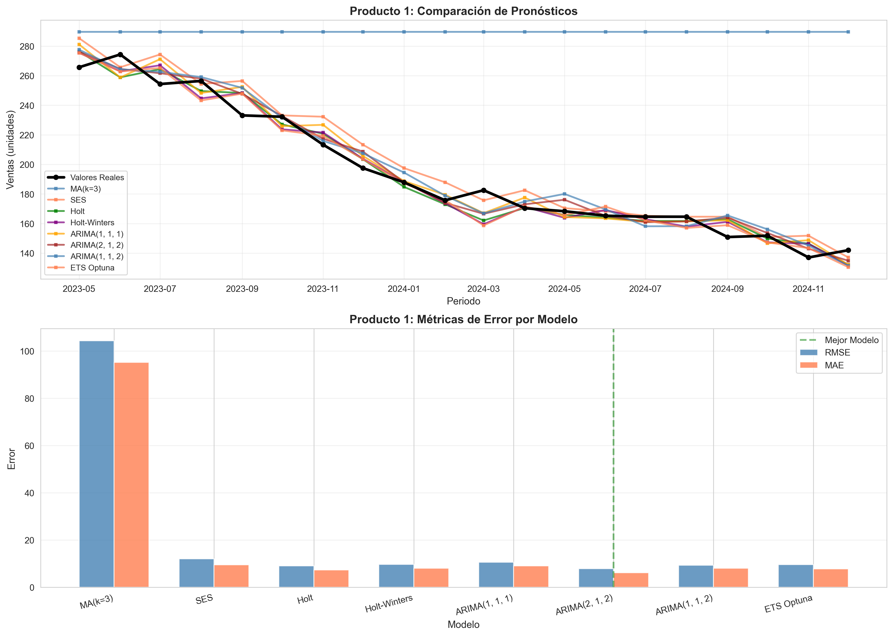
*Figura 4. Comparación visual de pronósticos recursivos - Producto 1*

**ARIMA(2,1,2) superó significativamente a todos los modelos**, con RMSE 13% inferior al segundo mejor (Holt).

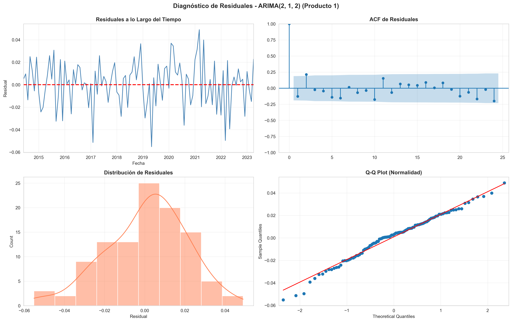
*Figura 5. Diagnóstico de residuales - Producto 1*

El diagnóstico de residuales confirmó comportamiento de ruido blanco (Ljung-Box p=0.065 > 0.05), validando la adecuación del modelo.

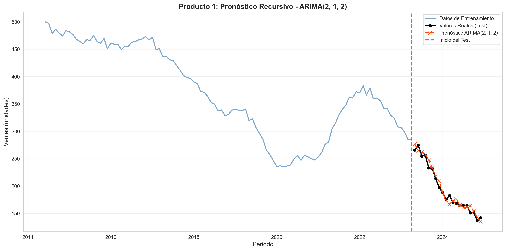
*Figura 6. Pronóstico con intervalos de confianza - Producto 1*

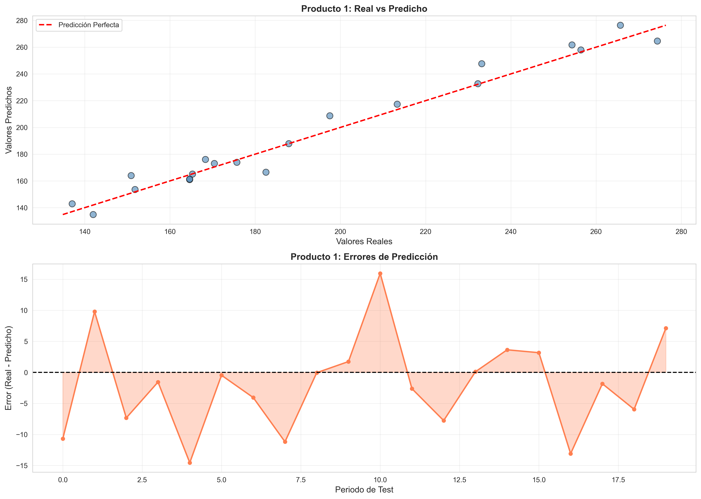
*Figura 7. Análisis de error en validación - Producto 1*

### 3.2 Producto 2: Crecimiento con Saturación

El Producto 2 mostró crecimiento de **+3.83 unidades/mes** con estabilización en ~680 unidades mensuales desde 2022.

| Modelo | RMSE | MAE | MAPE (%) |
|--------|:----:|:---:|:--------:|
| **ARIMA(2,1,2) ✓** | **9.29** | **8.12** | **1.24** |
| Holt | 10.15 | 8.91 | 1.37 |
| ETS Optuna | 11.05 | 9.31 | 1.45 |
| Holt-Winters | 11.27 | 9.52 | 1.48 |

*Tabla 2. Comparación de modelos para Producto 2*

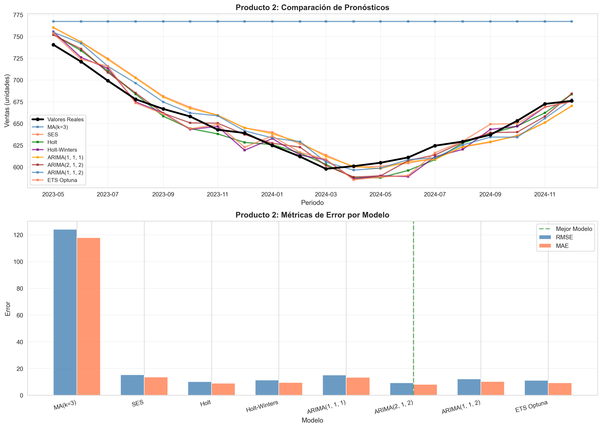
*Figura 8. Comparación visual de pronósticos recursivos - Producto 2*

ARIMA(2,1,2) nuevamente demostró superioridad con RMSE de 9.29, **9% mejor que Holt**. El MAPE excepcionalmente bajo (1.24%) indica alta precisión relativa.

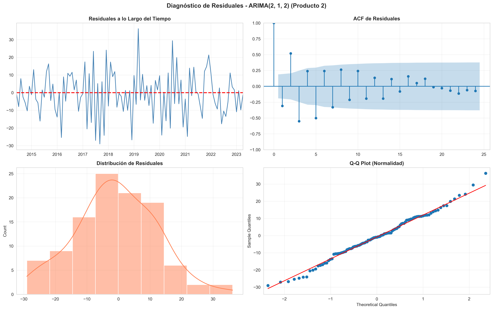
*Figura 9. Diagnóstico de residuales - Producto 2*

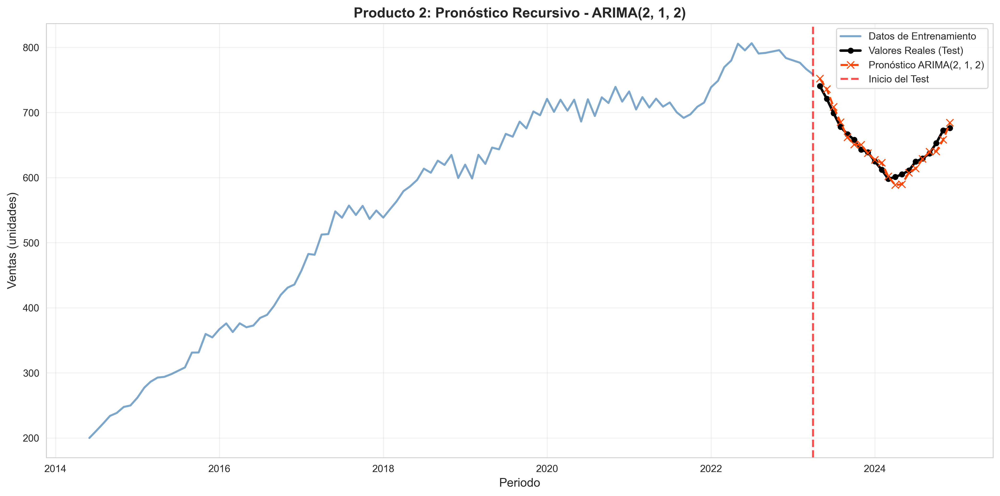
*Figura 10. Pronóstico con intervalos de confianza - Producto 2*

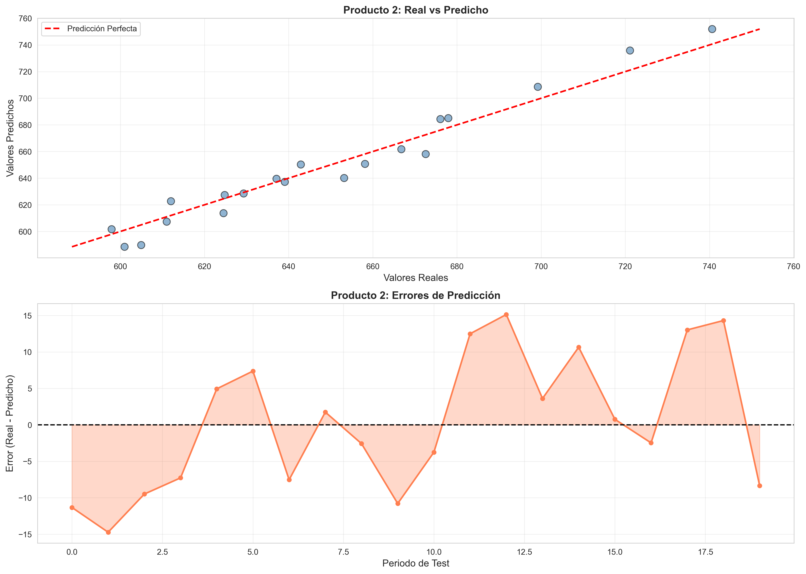
*Figura 11. Análisis de error en validación - Producto 2*

---

## 4. Pronósticos Finales y Recomendaciones

### 4.1 Pronósticos para Enero 2025

Los modelos ARIMA(2,1,2) finales se entrenaron con los 127 meses completos para generar pronósticos con intervalos de confianza del 95%:

| Producto | Pronóstico | IC 95% |
|----------|:----------:|:------:|
| **Producto 1** | **132 unidades** | [118, 146] unidades |
| **Producto 2** | **691 unidades** | [672, 710] unidades |

*Tabla 3. Pronósticos finales para enero 2025 con intervalos de confianza*

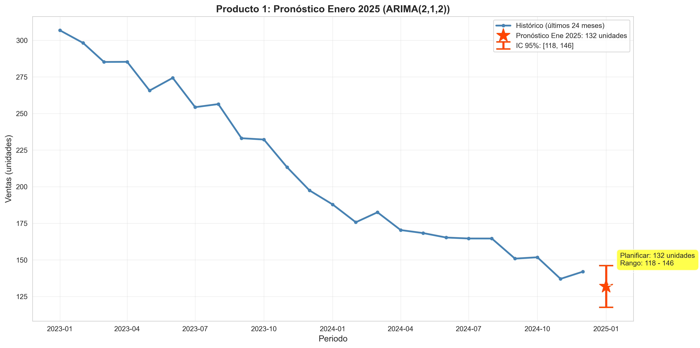
*Figura 12. Pronóstico final para enero 2025 - Producto 1*

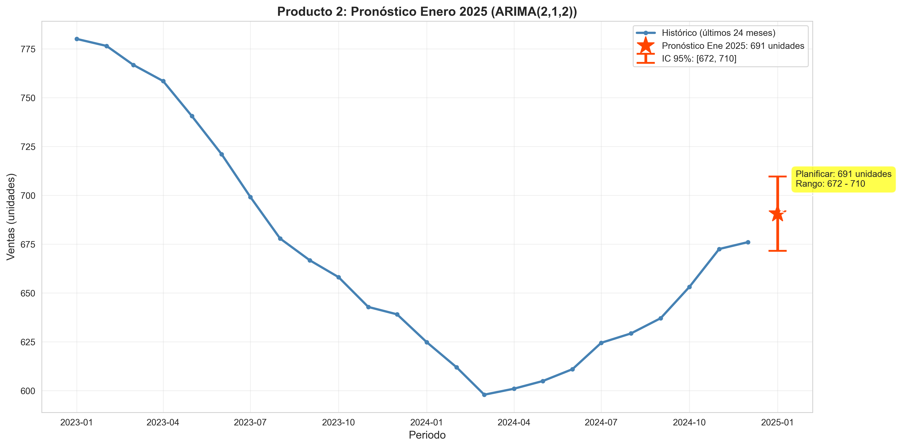
*Figura 13. Pronóstico final para enero 2025 - Producto 2*

### 4.2 Recomendaciones Operativas

#### Producto 1 (Declive)
- Evaluar causas del declive sostenido
- Considerar estrategias de revitalización o fase de salida planificada
- Optimizar inventario para evitar sobrestock

#### Producto 2 (Crecimiento estabilizado)
- Mantener niveles de inventario para demanda estable (~680-700 unidades)
- Monitorear señales de saturación del mercado
- Explorar oportunidades de expansión

---

## 5. Estructura del Proyecto

```
├── parcial-final-v1.ipynb   # Notebook principal con análisis completo
├── Examen.csv               # Datos de ventas históricos
├── requirements.txt         # Dependencias del proyecto
├── outputs/                 # Visualizaciones generadas
│   ├── fig1_series_completas.png
│   ├── fig2a_decomp_p1.png
│   ├── fig2b_decomp_p2.png
│   ├── fig3a_acf_pacf_p1.png
│   ├── fig3b_acf_pacf_p2.png
│   ├── fig4_comparacion_p1.png
│   ├── fig5_diagnostico_residuales_p1.png
│   ├── fig6_pronostico_p1.png
│   ├── fig7_analisis_error_p1.png
│   ├── fig8_comparacion_p2.png
│   ├── fig9_diagnostico_residuales_p2.png
│   ├── fig10_pronostico_p2.png
│   ├── fig11_analisis_error_p2.png
│   ├── fig12_pronostico_final_p1.png
│   └── fig13_pronostico_final_p2.png
└── README.md
```

## 6. Instalación y Uso

```bash
# Clonar el repositorio
git clone https://github.com/maxiplux/Aprendizaje-Autom-tico-III-Parcial-pr-ctico.git

# Instalar dependencias
pip install -r requirements.txt

# Ejecutar el notebook
jupyter notebook parcial-final-v1.ipynb
```

## 7. Tecnologías Utilizadas

- **Python 3.10.x
- **Pandas** - Manipulación de datos
- **NumPy** - Cálculos numéricos
- **Statsmodels** - Modelos ARIMA, pruebas estadísticas
- **Matplotlib/Seaborn** - Visualizaciones
- **Optuna** - Optimización de hiperparámetros

---

## Conclusiones

1. **ARIMA(2,1,2)** demostró ser el mejor modelo para ambos productos
2. La validación recursiva proporcionó una evaluación robusta y realista
3. Los intervalos de confianza del 95% permiten gestión de riesgo en inventarios
4. El Producto 1 requiere atención estratégica debido a su tendencia decreciente
5. El Producto 2 muestra estabilidad con oportunidades de crecimiento limitadas
